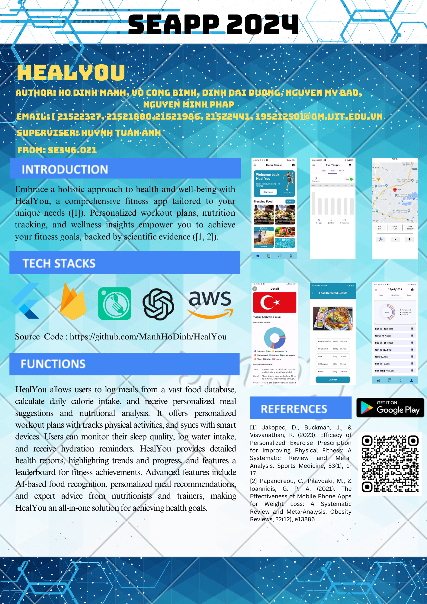

## Health and fitness application



## Table of contents

- [Introduction](#intruduction)
- [Install](#install)
- [Main functions](#main-functions)
- [Thanks](#thanks)

## Introduction


In today's fast-paced lifestyle, maintaining a healthy lifestyle has become increasingly challenging. However, with the advent of technology, managing one's health has become more accessible and convenient. Our Health Management Application is designed to empower individuals to take control of their well-being and lead healthier lives.

Our application provides a comprehensive suite of features to address various aspects of health management. From tracking daily activities such as exercise routines, dietary intake, and hydration levels, to monitoring vital health indicators like heart rate, blood pressure, and sleep patterns, our application offers a holistic approach to health tracking.

## Install

1. Clone repository:
    ```bash
    git clone https://github.com/ManhHoDinh/HealYou.git
    ```
2. install dependenciesc:
    ```bash
    flutter pub get
    ```
3. run the application:
    ```bash
    flutter run
    ```
## Main functions

Below are the main functions of the Library Management project:

### 1. Recommend dishes based on the user's weight loss needs

- Uses content-based filtering algorithm to recommend 5 dishes that suit the user's nutritional needs

- Statistics of nutritional ingredients in dishes
  
                  

### 2. Track running distance

- track running distance

- Calculate the distance the user has run

- Statistics on distance run by day, week, month

          


       


### 3. Track users drinking water

- Monitor the amount of water users have drunk

- Create appointment reminders

     

### 4. Track users sleeping

- Statistics on user sleep time
  
- Create alarm

  


## Thanks

This project has almost basically completed the functions of a healthcarre application. However, developed by a development team that is still university students and does not have enough experience, this project may have a problem. number of problems. You can download ours to get more experience. Thank you for visiting our project.

I appreciate every team member for showing tireless effort on this project.

